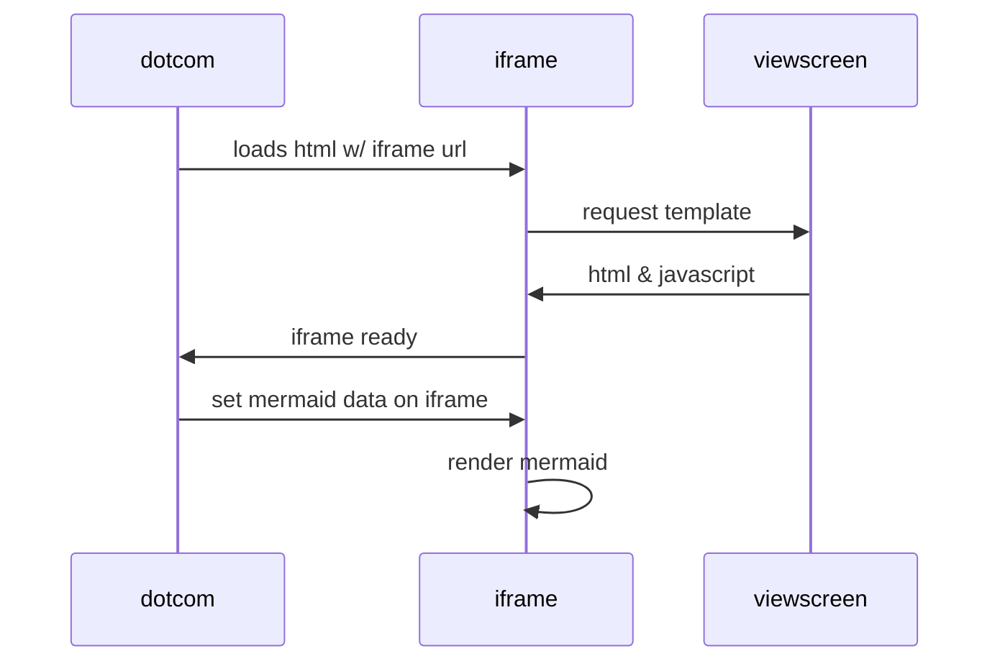
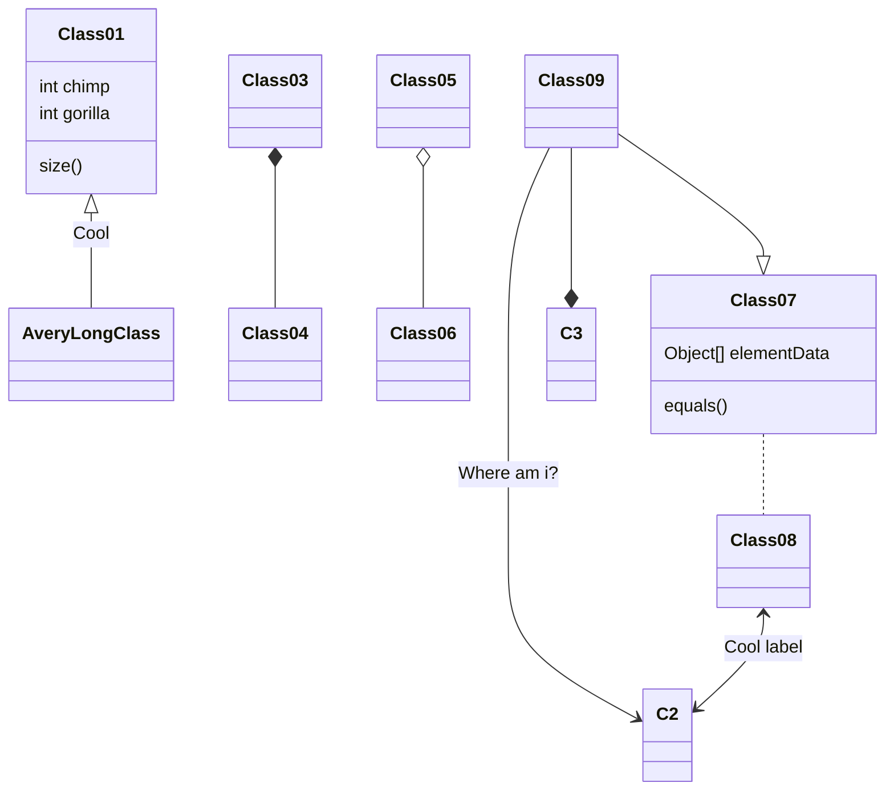
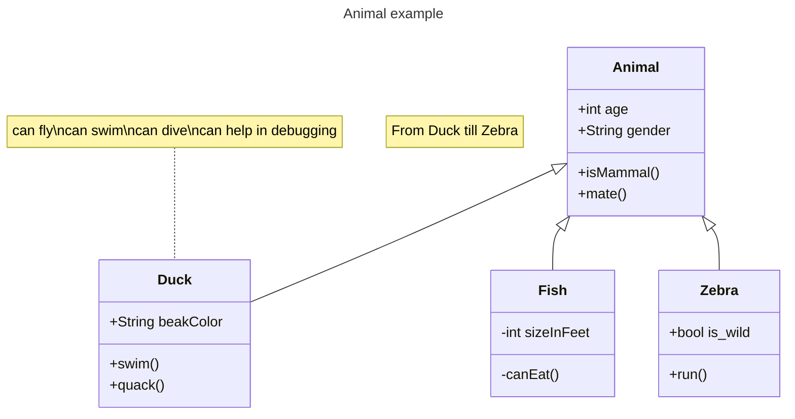
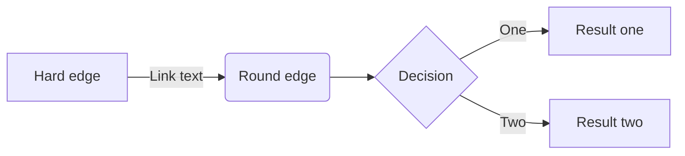
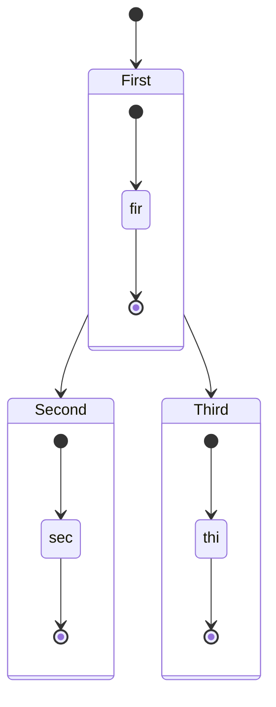

# Mermaid

## Interwork

* [Mermaid-cli](https://github.com/mermaid-js/mermaid-cli.git)
    * Mermaid-cli as preprocessor for markdown
* [A mermaid filter for pandoc on npm](https://github.com/raghur/mermaid-filter.git)


## examples












## Mermaid-cli Usage

* transform with mmdc and then render with pandoc to pdf 
```bash
 mmdc -i README.md -o README.transformed.md
 pandoc README.transformed.md -o README.pdf
```


