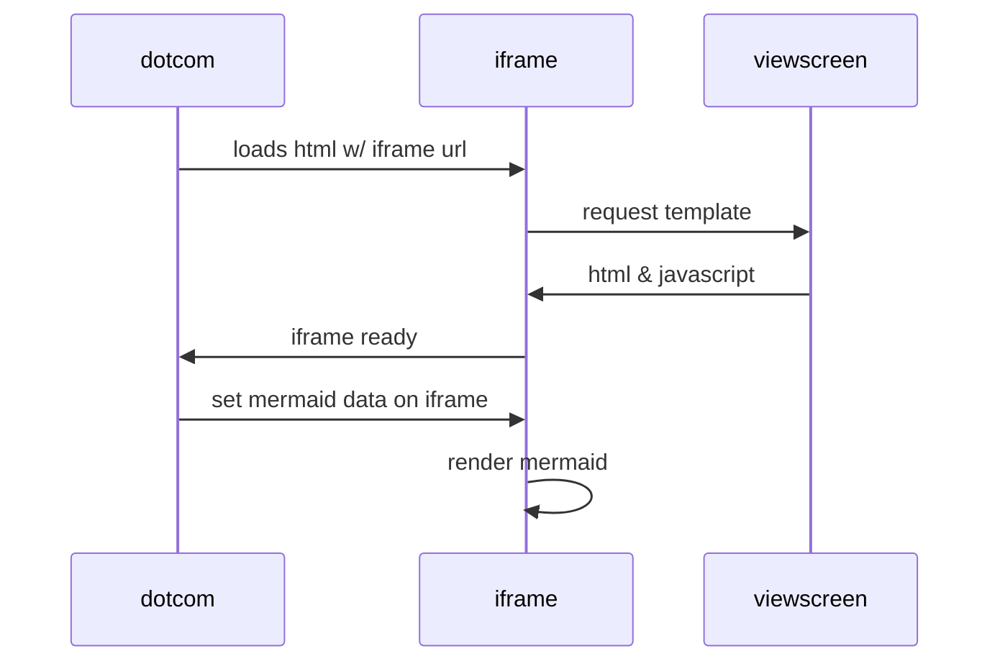
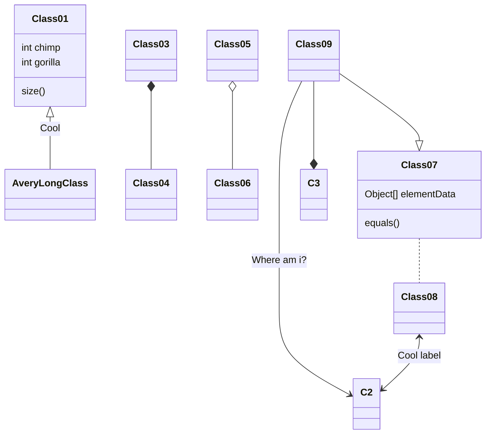

## Mermaid

### Interwork

* [Mermaid-cli](https://github.com/mermaid-js/mermaid-cli.git)
    * Mermaid-cli as preprocessor for markdown

* [A mermaid filter for pandoc on npm](https://github.com/raghur/mermaid-filter.git)
    * not currently used

### examples





### Mermaid-cli Usage

* transform with mmdc and then render with pandoc to pdf 
```bash
 mmdc -i README.md -o README.transformed.md
 pandoc README.transformed.md -o README.pdf
```


## pandoc-plot 

### A Pandoc filter to generate figures from code blocks in documents

[](https://www.gnu.org/licenses/gpl.html) 

`pandoc-plot` turns code blocks present in your documents (Markdown, LaTeX, etc.) into embedded figures, using your plotting toolkit of choice, including Matplotlib, ggplot2, MATLAB, Mathematica, and more.

### Overview

This program is a [Pandoc](https://pandoc.org/) filter. It can therefore
be used in the middle of conversion from input format to output format,
replacing code blocks with figures.

The filter recognizes code blocks with classes that match plotting
toolkits. For example, using the `matplotlib` toolkit:

```` markdown
# My document

This is a paragraph.

```{.matplotlib}
import matplotlib.pyplot as plt

plt.figure()
plt.plot([0,1,2,3,4], [1,2,3,4,5])
plt.title('This is an example figure')
```
````

```{.matplotlib}
import matplotlib.pyplot as plt

plt.figure()
plt.plot([0,1,2,3,4], [1,2,3,4,5])
plt.title('This is an example figure')
```

```{.matplotlib}
import numpy as np
import matplotlib.pyplot as plt

# evenly sampled time at 200ms intervals
t = np.arange(0., 5., 0.2)

# red dashes, blue squares and green triangles
plt.plot(t, t, 'r--', t, t**2, 'bs', t, t**3, 'g^')
```


Putting the above in `input.md`, we can then generate the plot and embed
it in an HTML page:

``` bash
pandoc --filter pandoc-plot input.md --output output.html
```

The resulting `output.html` looks like this:

```html
<h1 id="my-document">My document</h1>

<p>This is a paragraph.</p>

<figure>

</figure>
```

### Supported toolkits

`pandoc-plot` currently supports the following plotting toolkits
(**installed separately**):

  - `matplotlib`: plots using the [matplotlib](https://matplotlib.org/)
    Python library;
  - `plotly_python` : plots using the
    [plotly](https://plotly.com/python/) Python library;
  - `plotly_r`: plots using the [plotly](https://plotly.com/r/) R
    library
  - `matlabplot`: plots using [MATLAB](https://www.mathworks.com/);
  - `mathplot` : plots using
    [Mathematica](https://www.wolfram.com/mathematica/);
  - `octaveplot`: plots using [GNU
    Octave](https://www.gnu.org/software/octave/);
  - `ggplot2`: plots using [ggplot2](https://ggplot2.tidyverse.org/);
  - `gnuplot`: plots using [gnuplot](http://www.gnuplot.info/);
  - `graphviz`: graphs using [Graphviz](http://graphviz.org/);
  - `bokeh`: plots using the [Bokeh](https://bokeh.org/) visualization library;
  - `plotsjl`: plots using the [Julia `Plots.jl`](https://docs.juliaplots.org/latest/) package;
  - `plantuml`: diagrams using the [PlantUML](https://plantuml.com/) software suite;
  - `sageplot`: plots using the [Sage](https://www.sagemath.org/) software system.

To know which toolkits are useable on *your machine* (and which ones are
not available), you can check with the `toolkits` command:

``` bash
pandoc-plot toolkits
```

**Wish your plotting toolkit of choice was available? Please [raise an
issue](https://github.com/LaurentRDC/pandoc-plot/issues)\!**

### Documentation

You can find more information in the documentation, available either in the
source repository file `MANUAL.md`, on the [webpage](https://laurentrdc.github.io/pandoc-plot/MANUAL.html), or via the command `pandoc-plot --manual`.


